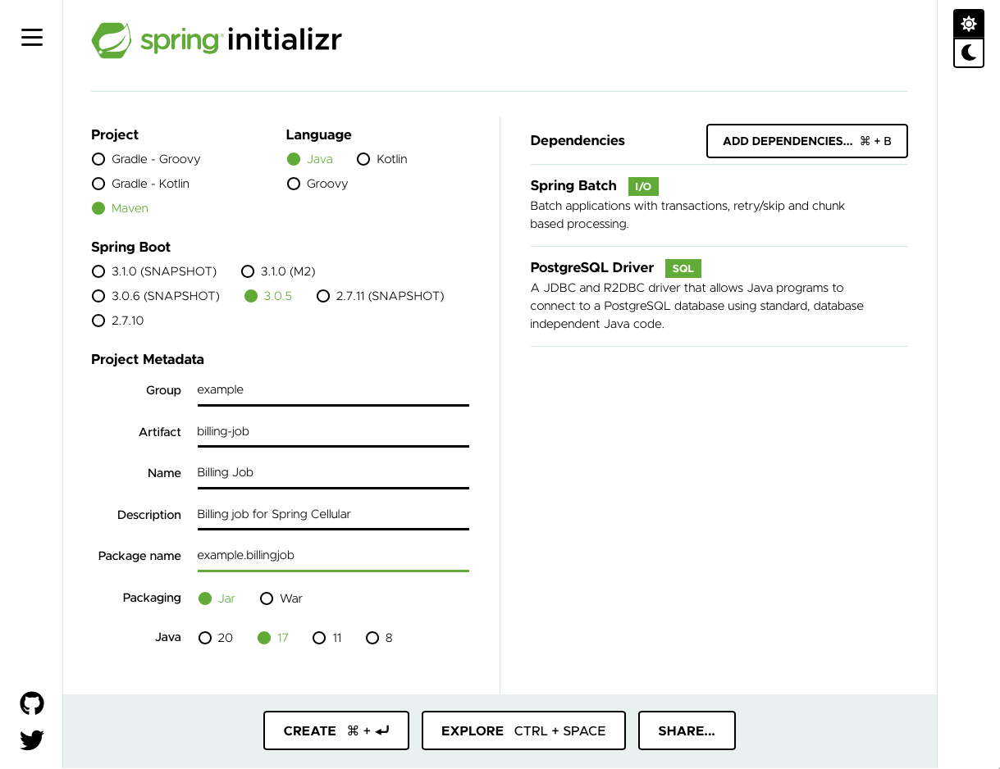

In this Lab, we focus on creating the basic structure of a Spring Batch project based on Spring Boot.

Just as if we're on a real project, let's start with a new project generated with Spring Initializr.

Complete the following steps to use Spring Initializr to set up the Spring Cellular's batch application.

1. Open the dashboard tab labeled `Spring Initializr`.

   ```dashboard:open-dashboard
   name: "Spring Initializr"
   ```

   

2. Select the following options:

   - Project: Maven
   - Language: Java
   - Spring Boot: The latest 3.0.X version

3. Enter the following values next to the corresponding Project Metadata fields:

   - Group: `example`
   - Artifact: `billing-job`
   - Name: `Billing Job`
   - Description: `Billing job for Spring Cellular`
   - Package name: `example.billingjob`
   - Packaging: `Jar`
   - Java: `17`

4. Select the `ADD DEPENDENCIES...` button from the `Dependencies` panel and add the following dependencies:

   - `Spring Batch`: Adds the `org.springframework.boot:spring-boot-starter-batch` artifact, which brings Spring Batch artifacts and other Spring Boot artifacts that are required for building a batch application.
   - `PostgreSQL Driver`: Adds the `org.postgresql:postgresql` artifact, which is the JDBC driver for PostgreSQL.

   In this course, we use [PostgreSQL](https://www.postgresql.org) as a database for the `JobRepository`. PostgreSQL is an open source production-grade object-relational database system.

   In this Lab and all Labs of this course, a PostgreSQL server is already up and running in a Docker container for your convenience.
   You will see how to access the database in the next section.
   For now, all we need is adding the JDBC driver dependency that will be used by the batch application to access the database.

5. Click the `CREATE` button. Spring Initializr generates a zip file of code and unzips it in your home directory.

   At this point, you should have the following structure in the `~/exercises/billing-job` directory:

   ```dashboard:open-dashboard
   name: Terminal
   ```

   ```shell
   [~/exercises/billing-job] $ tree .
   .
   ├── HELP.md
   ├── mvnw
   ├── mvnw.cmd
   ├── pom.xml
   └── src
       ├── main
       │   ├── java
       │   │   └── example
       │   │       └── billingjob
       │   │           └── BillingJobApplication.java
       │   └── resources
       │       └── application.properties
       └── test
           └── java
               └── example
                   └── billingjob
                       └── BillingJobApplicationTests.java

   11 directories, 8 files
   ```

   The project is structured as follows:

   - `src/main/java/example/billingjob/BillingJobApplication.java`: The main class of the Spring Boot application. It contains the `main` method and has the `@SpringBootApplication` annotation.
   - `src/test/java/example/billingjob/BillingJobApplicationTests.java`: This class contains the tests of our application.
   - `src/main/resources/application.properties`: Contains the configuration properties of the application. It is empty for the moment.
